# Create a custom authentication scheme

## Introduction

This lab walks you through the steps to create the necessary database objects for the custom authentication scheme.


Estimated Time: 20 minutes

### Objectives

In this lab, you will:
* Write a password hashing function
* Set up a user credentials table
* Write an authentication function
* Create a custom authentication scheme from the aforementioned database objects

### Prerequisites
This lab assumes you have:
* Read through the [Workshop Introduction](?lab=0-introduction) and met all of the prerequisites outlined there

## Task 0: Create an APEX Application

1. From your Oracle database, open APEX and sign in to your APEX Workspace.

	

2. Navigate to **App Builder** and click **Create**.

	*For this workshop we will create an empty "skeleton" application, but if you have an existing application that you want to implement custom authentication for, feel free to use your own.*
	

3. Select **New Application**.


4. Give your application a name and choose an application style/theme by clicking the pop-out  icon by **Appearance**.

	*If you want the application interface to appear exactly as it does in the screenshots in the [Introduction > About this Workshop](?lab=0-introduction#AboutthisWorkshop) section, then select **Redwood Light** as the style/theme.*

	

5. Next to **Features**, click **Check All**. We're going to leave the default **Settings** for now. Then click **Create Application**.

	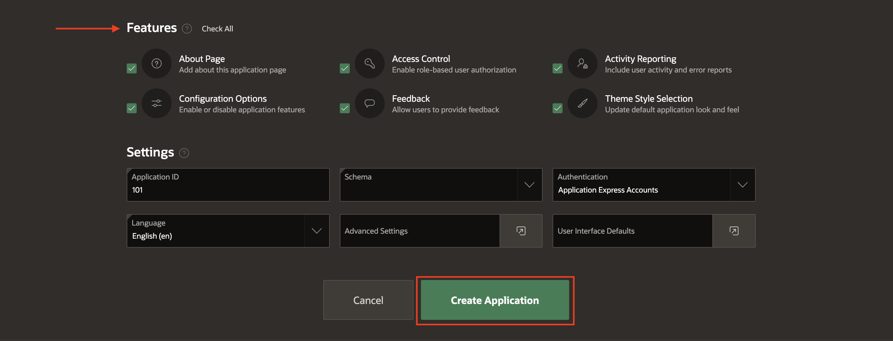

This concludes this task. You may now **proceed to the next task.**

## Task 1: Write a Password Hashing Function
Now that we have an application created, we're going to move on to creating the necessary Database objects for our custom authentication scheme.

In order to keep end users’ credentials secure, it is important to implement a password hashing function so that your developers and DBAs cannot simply read an end user’s password directly from a database table. This function takes in a raw password string and produces a unidirectional hash of the password using Oracle Database’s built-in **DBMS OBFUSCATION TOOLKIT** and its **MD5** hash.

The MD5 (message-digest) hashing algorithm is a one-way cryptographic function that accepts a message of any length as input and returns a fixed-length digest value as output. There are other hashing algorithms available that can be used here in place of MD5. There are also other ways of writing the below hashing function that still makes use of both the **DBMS OBFUSCATION TOOLKIT** and the MD5 hash, but with variations to the *input* to the MD5 hash. *For more information on the **DBMS_ OBFUSCATION_TOOLKIT**, see the [**Learn More**](#LearnMore) section at the end of this lab.*

1. Navigate to the SQL Code Editor by clicking the dropdown arrow next to **SQL Workshop** and selecting **SQL Commands**.

	

2. Copy & paste the code snippet below into the editor and click **Run**. A "Function created" message will appear below in the **Results**.

	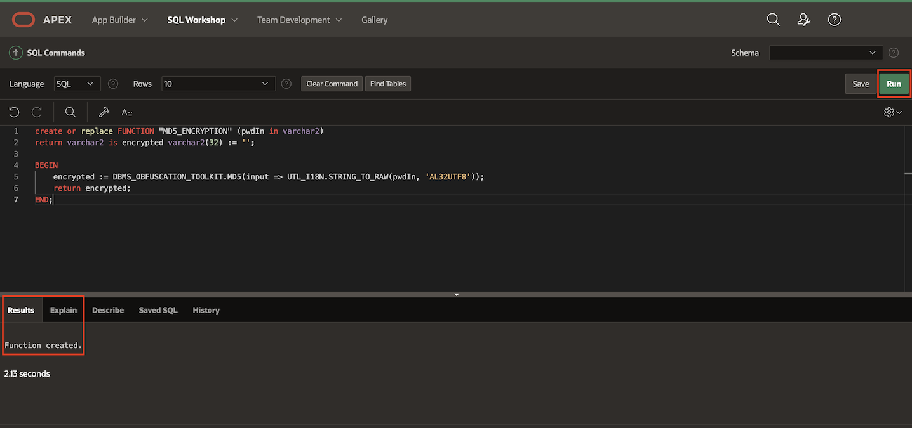

    ```
		<copy>
		create or replace FUNCTION "MD5_ENCRYPTION" (pwdIn in varchar2)
		return varchar2 is encrypted varchar2(32) := '';

		BEGIN
    		encrypted := DBMS_OBFUSCATION_TOOLKIT.MD5(input => UTL_I18N.STRING_TO_RAW(pwdIn, 'AL32UTF8'));
    		return encrypted;
		END;
		</copy>
    ```

This concludes this task. You may now **proceed to the next task.**

## Task 2: Set Up a User Credentials Table
All of your users’ authentication credentials and user information needs to be stored somewhere for your application to properly authenticate users upon login. This is the purpose of a user credentials table. For the table to function as intended, you will also need to create a couple of other Database Objects, such as constraints and triggers to maintain the uniqueness of usernames/emails as well as to set required values.


1. Navigate to the **Object Browser** by clicking the dropdown arrow next to **SQL Workshop** and selecting **Object Browser**.

	

2. In the top-right corner of the screen, click the  icon and click **Table**.

3. Give it a **Table Name** and add the **Columns** shown in the screenshot below. Then click **Next**.

	> **Note:** Feel free to change the **Column Names** to your liking as well as the **Precision** and **Scale**. We recommend keeping the **Data Type**, **Not Null**, and **Identity** information as shown. The **ACCOUNT_STATUS** column is optional. This "flag" will be used later to implement the additional functionality discussed in Lab 3.

	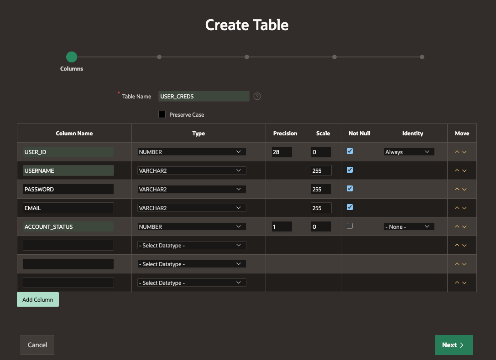

4. Select **Populated by Identity column** for the **Primary Key** and leave the **Primary Key Constraint Name** as is. From the dropdown, select the **USER_ID** column as the **Primary Key**. Then click **Next**.

	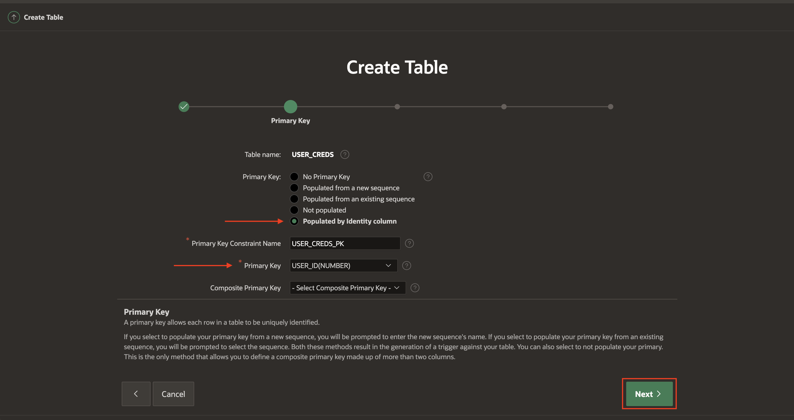

5. Because we don't have any other tables in our APEX Workspace at this time, we cannot set up any foreign keys. You can simply click **Next** on this page.

6. If you don't want usernames and/or emails to be repeated (which is often the desired restriction), we need to create a **Unique Constraint**. Next to **Constraint Type** select **Unique** and double-click on the desired column where it says **Key Column(s)**. After double-clicking the desired column, it will move to the box on the right (see screenshot below). Give the constraint a **Name** and then click **Add** in the top-right.

 	

7. Before clicking **Next**, create any additional constraints that you would like by repeating step 6. Ensure all your constraints appear in the table in the top-left corner (see screenshot below). Once all of your desired constraints have been created and properly added to this table, then click **Next**.

	

8. If you're interested in seeing the SQL code associated with creating the table, click on the  icon next to **SQL**. Feel free to copy the SQL code and save it to a local notepad if you're interested in reviewing it later or in replicating this table in another APEX Workspace. Then click **Create Table**.

	*To use the SQL Code to replicate this table in another workspace, you can simply copy & paste the code into **SQL Workshop > SQL Commands** and run the code to create the same table that we've created here.*

	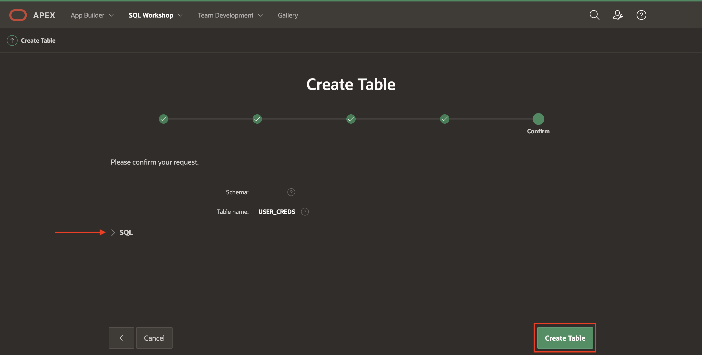

	This table will now appear in your **Object Browser**. Feel free to explore the different Database Objects that have been created for this table (**Indexes**, **Constraints**, etc.) by clicking on different tabs seen below the table name (see screenshot below).

	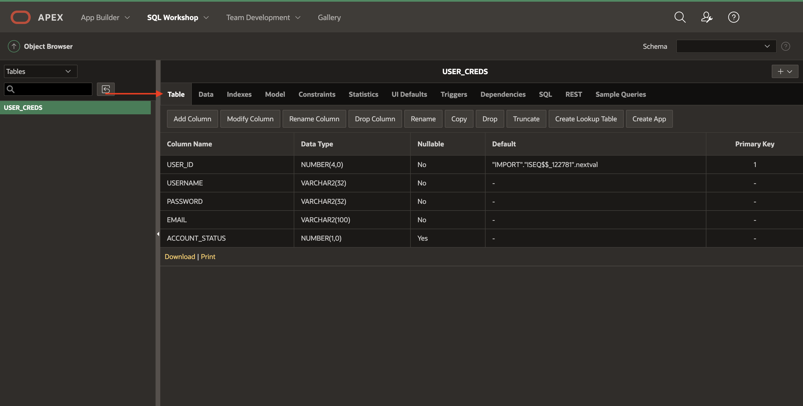

9. Now that we have the user credentials table created, we need to create a couple of **Triggers** for this table. Navigate to the **Triggers** tab and click **Create** (see screenshot below).

	*For more information on **Triggers**, see the [**Learn More**](#LearnMore) section at the end of this lab.*

	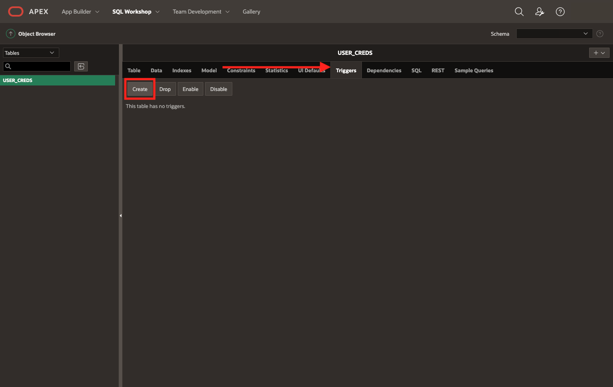

10. Every time a new user is created, we want to ensure their password is encrypted before storing it. To do so, we will create a Trigger that calls our password hashing function (from [Task 1](#Task1:WriteaPasswordHashingFunction)) before inserting the password. Give the Trigger a **Name**, select "BEFORE" as the **Firing Point**, and select "insert" for **Options**. Copy and paste the code snippet below into the **Trigger Body** and then click **Next**.

	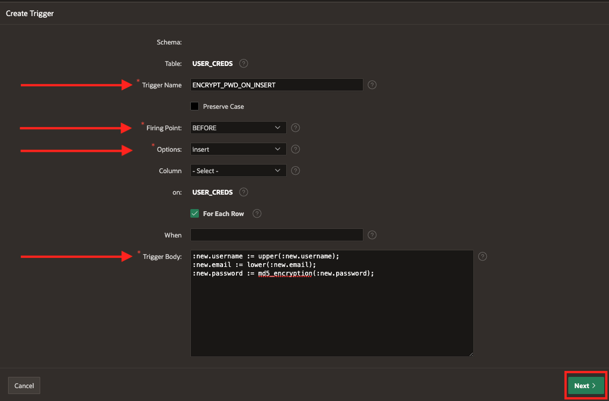

	```
	<copy>
	:new.username := upper(:new.username);
	:new.email := lower(:new.email);
	:new.password := md5_encryption(:new.password);
	</copy>
	```

11. Finally, click **Create Trigger**.

12. We also want to ensure that the user's password is encrypted if they were ever to go back and reset/update their password. Create a Trigger that calls the password hashing function before any updates are made on the password. Repeat steps 9 through 11, but for the **Firing Point**, select "update of", and for **Column**, select "PASSWORD" from the dropdown. Because this only pertains to updates on the password, we just need the last line in the code snippet above (starting with ":new.password") for the **Trigger Body**. The final Trigger should look like the one in the screenshot below.

	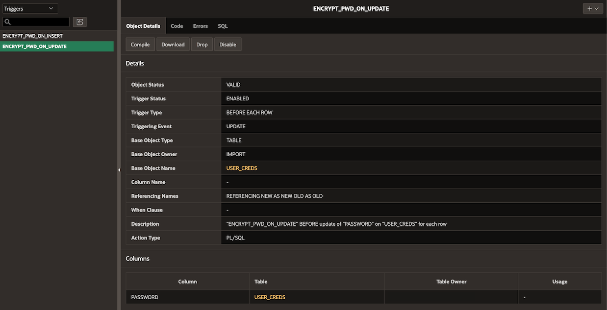

13. If you added the optional **ACCOUNT_STATUS** flag back in step 3, we also need to create a Trigger that initially sets this value to 0, signifying a disabled account until the user activates their account via email. This account activation functionality will be implemented later on in [Lab 3: Implementing Additional Functionality](?lab=3-implement-additional-functionality). To create this Trigger, click on the **Triggers** tab of your user credentials table and click **Create**. Give the Trigger a **Name** and set the **Firing Point** as "BEFORE". From the dropdown, select "insert" for the **Options**. Copy & paste the code snippet below into the **Trigger Body** and then click **Next**.

	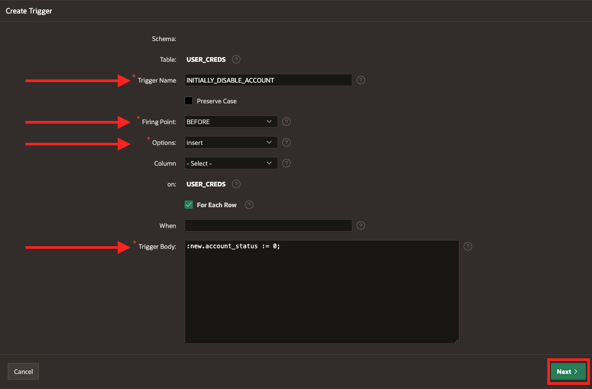

	```
	<copy>
	:new.account_status := 0;
	</copy>
	```

14. Finally, click **Create Trigger**.

This concludes this task. You may now **proceed to the next task.**

## Task 3: Write an Authenticate Function

The authentication function is the function called at login. It takes in a username and password and queries the user credentials table to see if the account exists, if the account is enabled (**ACCOUNT_STATUS** flag is 1), and if the password is correct. This particular implementation allows users to log in with their username *or* email. If you’d like, you can modify this authentication function so that *only the username* or *only the email* can be used for login.

1. Navigate to the SQL Code Editor by clicking the dropdown arrow next to **SQL Workshop** and selecting **SQL Commands**.

	

2. Copy & paste the code snippet below into the editor and click **Run**. A "Function created" message will appear below in the **Results**.

	```
	<copy>
	create or replace FUNCTION "AUTHENTICATE_USER"
  (p_username in varchar2,  
   p_password in varchar2)
	return boolean
	IS
	  uc_username           varchar2(255) := upper(p_username);
	  lc_email              varchar2(255) := lower(p_username);
	  login_with_email      number := 0;
	  login_with_username   number := 0;
	  retrieved_pwd         varchar2(255);
	  encrypted_pwd         varchar2(255);
	  v_verification        number;

	BEGIN
	-- check if logging in with username or email
	    select count(*)  
	    into login_with_username  
	    from user_creds
	    where username = uc_username;
	    select count(*)  
	    into login_with_email  
	    from user_creds
	    where email = lc_email;
	    if login_with_email = 0 and login_with_username = 0 then
	        raise_application_error(-20323, 'User does not exist');
	        return false; -- user does not exist
	    end if;
	 -- check if account is activated
	    select account_status into v_verification from user_creds where email = lc_email or username = uc_username;
	    if v_verification = 0 then
	        raise_application_error (-20343, 'Your email is not verified yet or you have just reset your password. Please check your email for further instructions.');
	        return false;
	    end if;
	-- retrieve the user's password
	    select password  
	    into retrieved_pwd  
	    from user_creds  
	    where username = uc_username or email = lc_email;
	--if the passwords match return true, otherwise return false
	    select md5_encryption(p_password) into encrypted_pwd from dual;

	    if retrieved_pwd = encrypted_pwd then
	        return true;
	    else
	        raise_application_error(-20333, 'Incorrect password');
	        return false;
	    end if;
	END;
	</copy>
	```

This concludes this task. You may now **proceed to the next task.**

## Task 4: Create the Authentication Scheme

Now we will put all the pieces together to build out our custom authentication scheme.

1. First, go to the Authentication Schemes page in APEX by navigating to **App Builder** and selecting your application.

2. Click on **Shared Components**.

	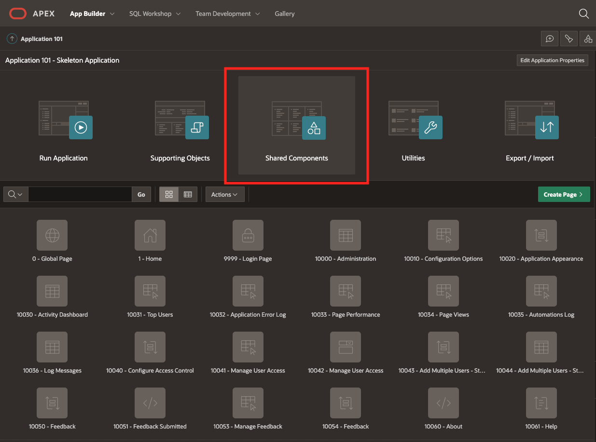

3. Next, locate **Security** and click on **Authentication Schemes**.

	

4.	Click **Create** in the top-right corner.

	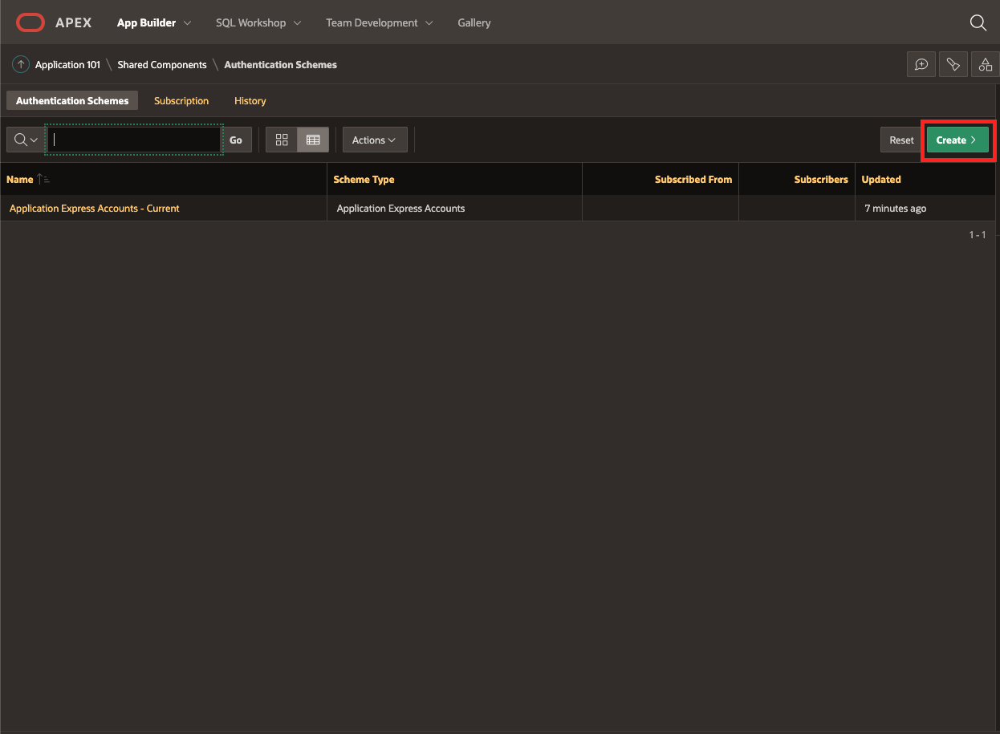

5.	Select **Create Scheme: Based on a pre-configured scheme from the gallery** and then click **Next**.

	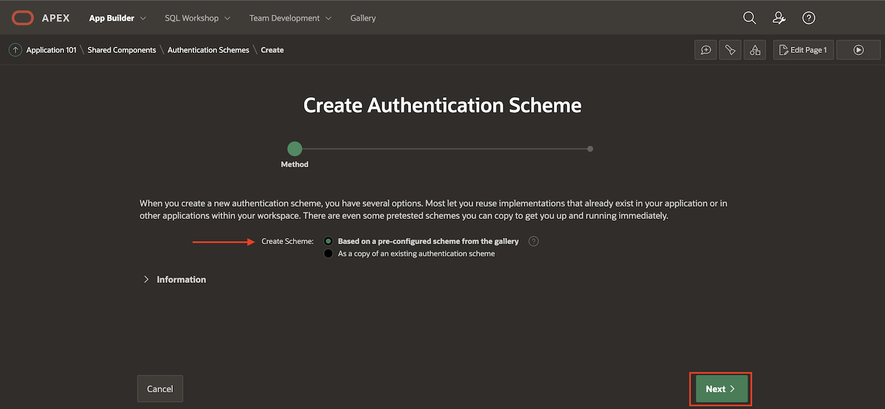

6.	Give the Authentication Scheme a **Name** – for example: “Custom authentication for end-user account creation” and select Custom as the **Scheme Type**.

	

7.	Where it says **Authentication Function Name** in the **Settings** section, put the name of your authentication function (in our case enter “authenticate_user”). Then click **Create Authentication Scheme**.

	

8.	It will take you back to the Authentication Schemes page. A green success message should appear at the top saying that this new Authentication Scheme was set as the current scheme. Additionally, “- Current” should now be displayed next to the new custom authentication scheme you just created.

	

9. While we will not discuss Authorization Schemes in-depth in this workshop, we do need to make a change to our application's security as it pertains to Authorization in order for us to continue with the workshop. Return to the application home page by clicking on "Application XXX" from the Breadcrumb menu in the top-left.

	*Check out the [Learn More](#LearnMore) section at the end of this lab to learn more about Authorization Schemes.*

	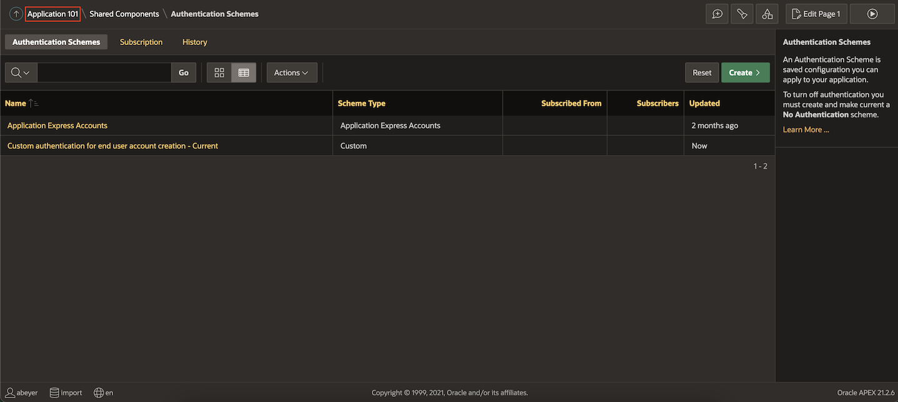

10. Click on the "Edit Application Properties" button in the top-right.

	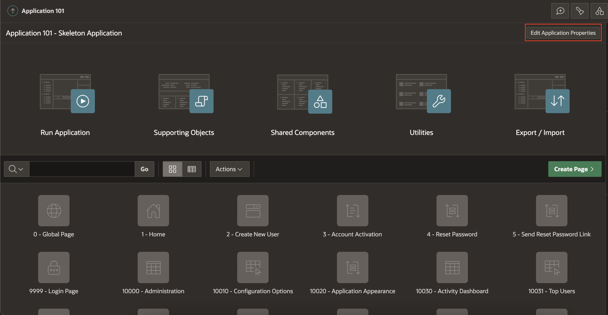

11. Navigate to the **Security** menu along the top toolbar.

	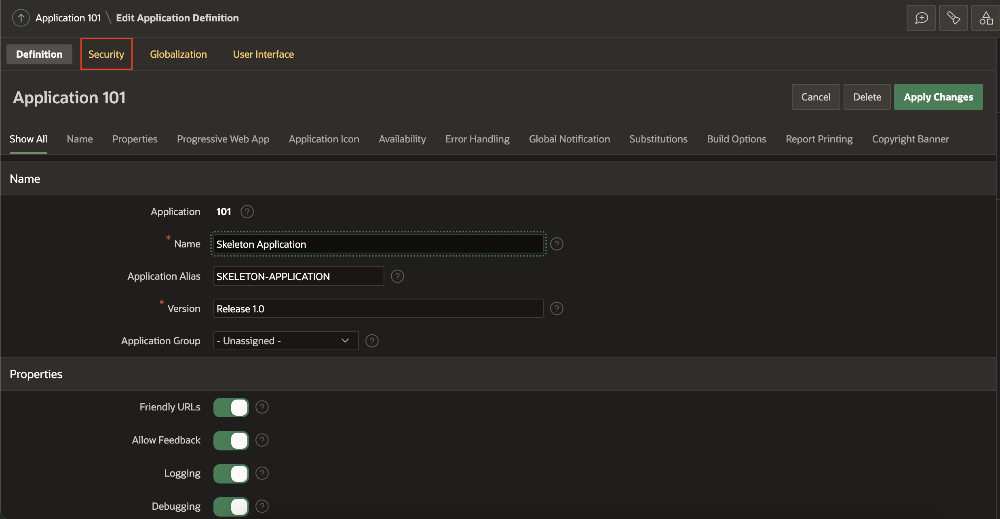

12. Under **Authorization**, select "- No application authorization required -" for the **Authorization Scheme**. Then click **Apply Changes** in the top-right corner.

	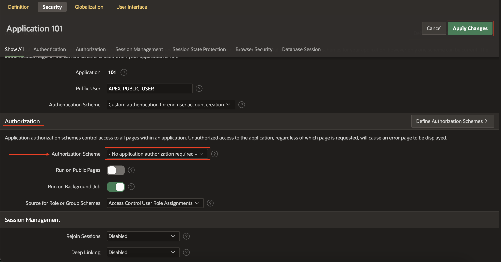

This concludes this lab. You may now **proceed to the next lab**.

## Learn More

* [Understanding Authentication](https://docs.oracle.com/en/database/oracle/application-express/19.2/htmdb/understanding-authentication.html#GUID-144A774D-2B05-4BE5-9550-6951EE0B536B) in Oracle APEX
* [Creating an Authentication Scheme](https://docs.oracle.com/en/database/oracle/application-express/19.2/htmdb/creating-an-authentication-scheme.html#GUID-093A9521-FDEB-432A-891D-791ED402C333) in Oracle APEX
* [Custom Authentication](https://docs.oracle.com/en/database/oracle/application-express/19.2/htmdb/preconfigured-authentication-schemes.html#GUID-27D42A6E-8BF5-44CB-BDB3-E7F544CDE267) in Oracle APEX
* [Triggers](https://docs.oracle.com/en/database/oracle/application-express/21.2/aeutl/managing-triggers.html#GUID-2054B50C-53E6-4C92-9334-A055AF653177) in Oracle APEX
* [DBMS OBFUSCATION TOOLKIT](https://docs.oracle.com/cd/E11882_01/appdev.112/e40758/d_obtool.htm#ARPLS028)
* [Understanding Authorization Schemes](https://docs.oracle.com/en/database/oracle/application-express/21.2/htmdb/providing-security-through-authorization.html#GUID-8FBF5F46-0541-4859-8470-D10E333DD271) in Oracle APEX

## Acknowledgements
* **Author** - Ana Beyer, Cloud Engineer, Oracle
* **Last Updated By/Date** - Ana Beyer, July 2022
