# Create a custom authentication scheme

## Introduction

This lab walks you through the steps to create the necessary database objects for the custom authentication scheme.


Estimated Time: 20 minutes

### Objectives

In this lab, you will:
* Write a password hashing function
* Set up a user credentials table
* Write an authentication function
* Create a custom authentication scheme from the aforementioned database objects

### Prerequisites
This lab assumes you have:
* Read through the [Workshop Introduction](?lab=0-introduction) and met all of the prerequisites outlined there

## Task 0: Create an APEX Application

1. From your Oracle database, open APEX and sign in to your APEX Workspace.

	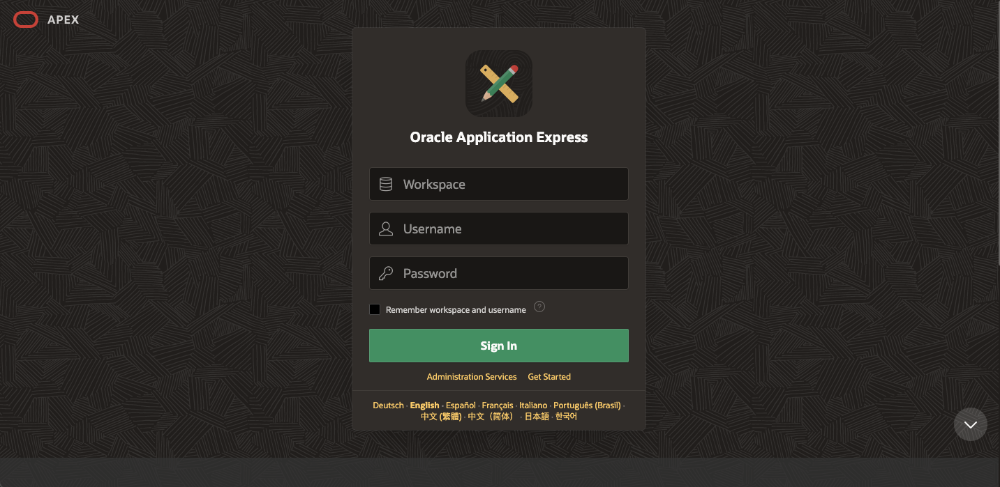

2. Navigate to **App Builder** and click **Create**.

	*For this workshop we will create an empty "skeleton" application, but if you have an existing application that you want to implement custom authentication for, feel free to use your own.*
	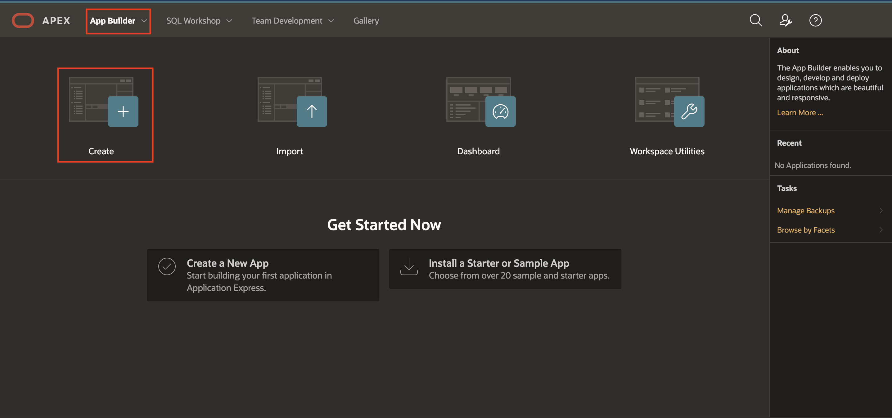

3. Select **Use Create App Wizard**.
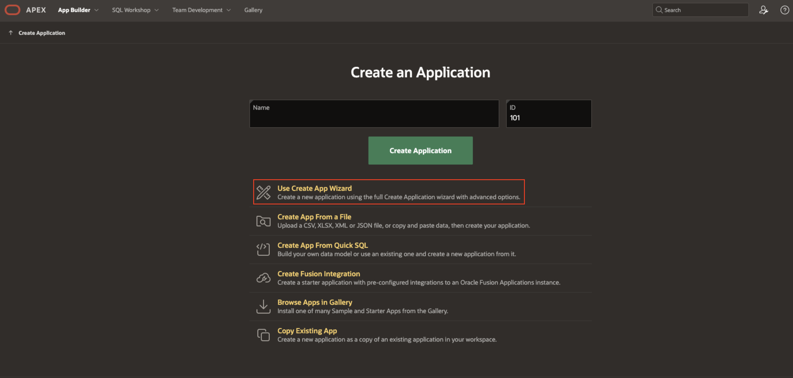

4. Give your application a name and choose an application style/theme by clicking the pop-out  icon by **Appearance**.

	*If you want the application interface to appear exactly as it does in the screenshots in the [Introduction &gt; About this Workshop](?lab=0-introduction#AboutthisWorkshop) section, then select **Redwood Light** as the style/theme.*

	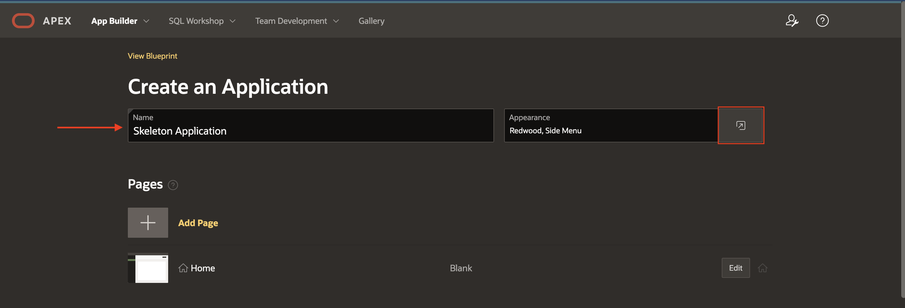

5. Next to **Features**, click **Check All**. We're going to leave the default **Settings** for now. Then click **Create Application**.

	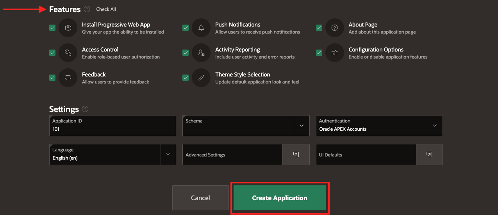

This concludes this task. You may now **proceed to the next task.**

## Task 1: Write a Password Hashing Function
Now that we have an application created, we're going to move on to creating the necessary Database objects for our custom authentication scheme.

In order to keep end users’ credentials secure, it is important to implement a password hashing function so that your developers and DBAs cannot simply read an end user’s password directly from a database table. This function takes in a raw password string and produces a unidirectional hash of the password using Oracle Database’s built-in **DBMS CRYPTO** interface and its **SHA-256** hash. In order to use this interface, you must grant the schema being used for this APEX application access to it. You can do so by running the following code snippet from the database that your APEX instance is running on in **Database Actions** > **SQL** (while logged in as the administrator), replacing 'schema_name' with your schema. If you don't which schema you're using, refer to the screenshot in step 2 of this Task (in the top-right corner).

```
<copy>
grant execute on dbms_crypto to schema_name;
</copy>
```

The SHA-256 (Secure Hashing Algorithm 256) is a one-way, unkeyed cryptographic function that accepts a message of any length as input and returns a 256-bit long hash output. There are other hashing algorithms available that can be used here in place of SHA-256, however this algorithm is widely accepted as one of the most commonly used and best hashing algorithms. *For more information on the **DBMS_ CRYPTO** interface, see the [**Learn More**](#LearnMore) section at the end of this lab.*

1. Navigate to the SQL Code Editor by clicking the dropdown arrow next to **SQL Workshop** and selecting **SQL Commands**.

	

2. Copy & paste the code snippet below into the editor and click **Run**. A "Function created" message will appear below in the **Results**.

	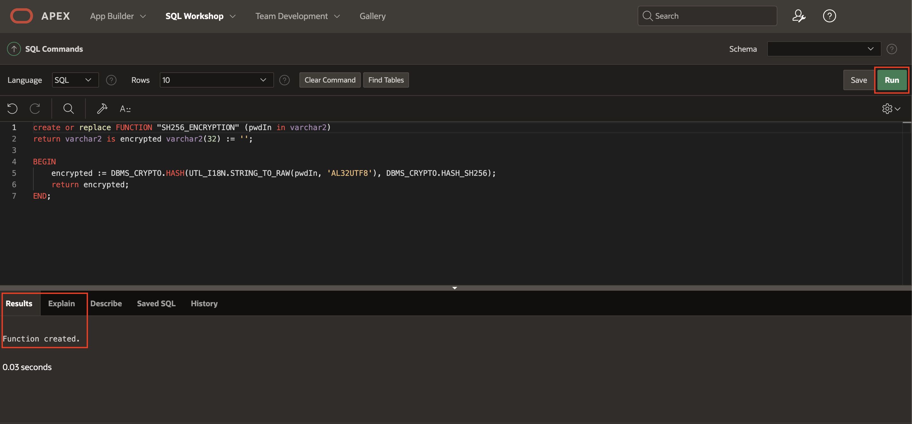

    ```
		<copy>
		create or replace FUNCTION "SH256_ENCRYPTION" (pwdIn in varchar2)
		return varchar2 is encrypted varchar2(32) := '';

		BEGIN
		    encrypted := DBMS_CRYPTO.HASH(UTL_I18N.STRING_TO_RAW(pwdIn, 'AL32UTF8'), DBMS_CRYPTO.HASH_SH256);
		    return encrypted;
		END;
		</copy>
    ```

This concludes this task. You may now **proceed to the next task.**

## Task 2: Set Up a User Credentials Table
All of your users’ authentication credentials and user information needs to be stored somewhere for your application to properly authenticate users upon login. This is the purpose of a user credentials table. For the table to function as intended, you will also need to create a couple of other Database Objects, such as constraints and triggers to maintain the uniqueness of usernames/emails as well as to set required values.


1. Navigate to the **Object Browser** by clicking the dropdown arrow next to **SQL Workshop** and selecting **Object Browser**.

	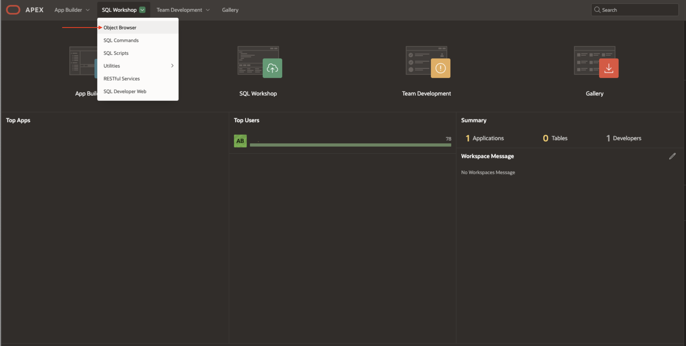

2. Click **Table**.

	

3. Give it a **Table Name** and add the **Columns** shown in the screenshot below by double-clicking cells to edit and clicking the **Add Column** button. Use the dropdown to select the **Data Type** and use the checkboxes for **Not Null** and **Primary Key** accordingly. When complete, click **Create Table**.

	> **Note:** If you're interested in seeing the SQL code associated with creating the table, click on the **Preview SQL** button before proceeding. Feel free to copy the SQL code and save it to a local notepad if you're interested in reviewing it later or in replicating this table in another APEX Workspace. To do so, you can simply copy & paste the code into **SQL Workshop &gt; SQL Commands** and run the code to create the same table that we've created here.*

	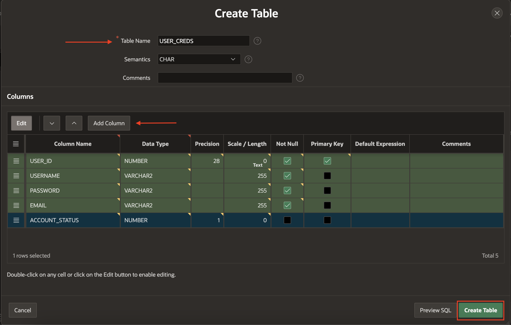

	This table will now appear in your **Object Browser**. Feel free to explore the different Database Objects that have been created for this table by clicking on different tabs seen below the table name (see screenshot below).

	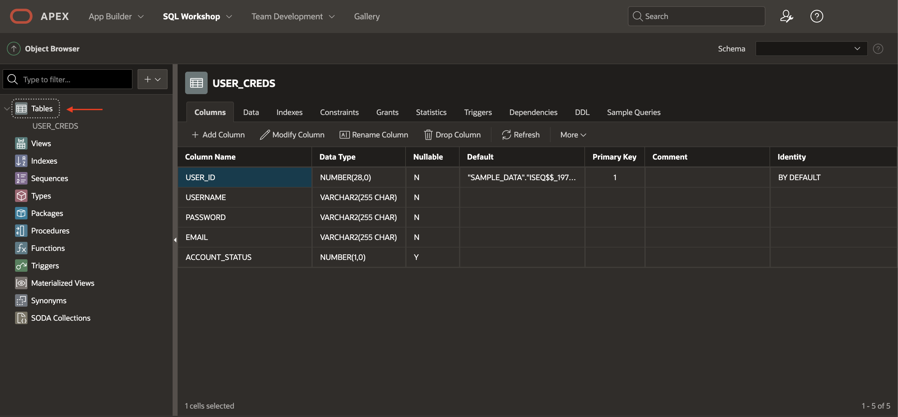

4. If you don't want usernames and/or emails to be repeated (which is often the desired restriction), we need to create a few **Constraints**. Navigate to the **Constraints** tab and click **+ Create**.

 	

5. Give the constraint a **Name** and select **Unique** from the dropdown for the **Constraint Type**. Then select the **USERNAME** column from the dropdown and click **Apply**. Repeat this process (steps 4 & 5) for the **EMAIL** column.

	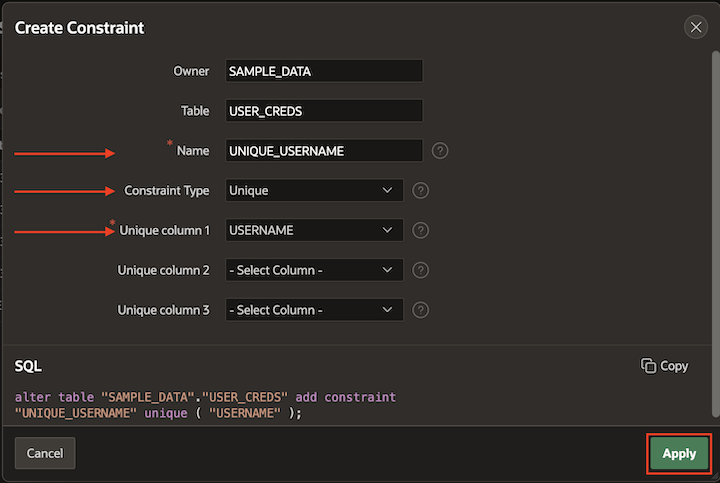


6. Now that we have the user credentials table created with our desired constraints, we need to create a couple of **Triggers** for this table. Navigate to the **Triggers** tab and click **Create** (see screenshot below).

	*For more information on **Triggers**, see the [**Learn More**](#LearnMore) section at the end of this lab.*

	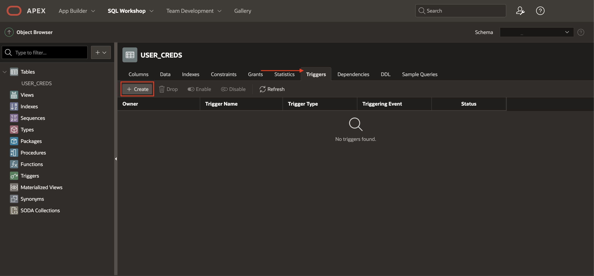

7. Every time a new user is created, we want to ensure their password is encrypted before storing it. To do so, we will create a Trigger that calls our password hashing function (from [Task 1](#Task1:WriteaPasswordHashingFunction)) before inserting the password. Ensure the **Table** is our user credentials table, give the Trigger a **Trigger Name**, and select "Before" as the **Firing Point**. Then click **Create Trigger**.

	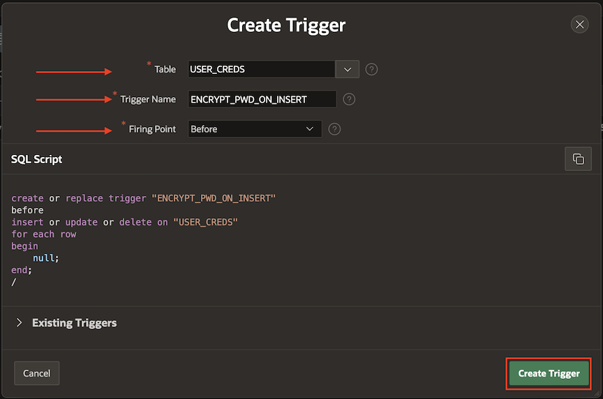

8. Notice we've only given the Trigger a name and said when to run ("Before"). Now we need to actually write the logic for the trigger. Where it says "null", copy & paste the code snippet below.

	```
	<copy>
	:new.username := upper(:new.username);
	:new.email := lower(:new.email);
	:new.password := sh256_encryption(:new.password);
	</copy>
	```

	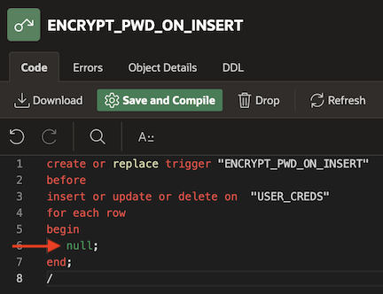

9. Let's take a look at the line after "before" in the above screenshot. This indicates that this trigger should run before any insert, update, or deletion within our user credentials table. This isn't necessarily our desired functionality. We only want to encrypt a user's password when they're first added to the table so let's get rid of "or update or delete".  Now click **Save and Compile** and ensure you get a success message.

 	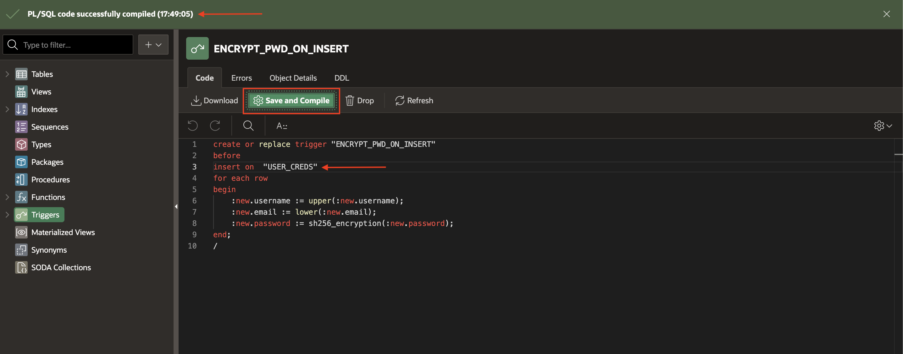

10. We also want to ensure that the user's password is encrypted if they were ever to go back and reset/update their password. Create a Trigger that calls the password hashing function before any updates are made on the password. Repeat steps 6 through 8. When copying & pasting the code snippet in step 8, only keep the last line (starting with ":new.password").

	

11. As the trigger is configured right now, it is set to run whenever there's an insert, update, or deletion in the table, but that would mean the password is also encrypted again when a user tries to change their email, which we do NOT want to happen. Thus, we need to change the line after "before" to the code snippet below. Remember to **Save and Compile** when done.

	```
	<copy>
	update of "PASSWORD" on "USER_CREDS"
	</copy>
	```

	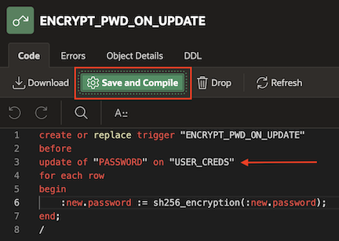

12. If you added the optional **ACCOUNT_STATUS** flag back in step 3, we also need to create a Trigger that initially sets this value to 0, signifying a disabled account until the user activates their account via email. This account activation functionality will be implemented later on in [Lab 3: Implementing Additional Functionality](?lab=implement-additional-functionality). Create this Trigger, following the same process as before. Refer to the screenshot below if you get stuck and/or feel free to copy the code directly from below.

	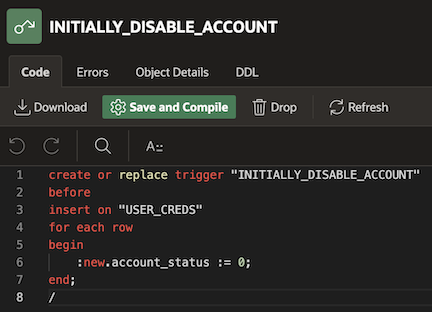

	```
	<copy>
	create or replace trigger "INITIALLY_DISABLE_ACCOUNT"
	before
	insert on "USER_CREDS"
	for each row
	begin
	    :new.account_status := 0;
	end;
	/
	</copy>
	```

This concludes this task. You may now **proceed to the next task.**

## Task 3: Write an Authenticate Function

The authentication function is the function called at login. It takes in a username and password and queries the user credentials table to see if the account exists, if the account is enabled (**ACCOUNT_STATUS** flag is 1), and if the password is correct. This particular implementation allows users to log in with their username *or* email. If you’d like, you can modify this authentication function so that *only the username* or *only the email* can be used for login.

1. Navigate to the SQL Code Editor by clicking the dropdown arrow next to **SQL Workshop** and selecting **SQL Commands**.

	

2. Copy & paste the code snippet below into the editor and click **Run**. A "Function created" message will appear below in the **Results**.

	```
	<copy>
	create or replace FUNCTION "AUTHENTICATE_USER"
  (p_username in varchar2,  
   p_password in varchar2)
	return boolean
	IS
	  uc_username           varchar2(255) := upper(p_username);
	  lc_email              varchar2(255) := lower(p_username);
	  login_with_email      number := 0;
	  login_with_username   number := 0;
	  retrieved_pwd         varchar2(255);
	  encrypted_pwd         varchar2(255);
	  v_verification        number;

	BEGIN
	-- check if logging in with username or email
	    select count(*)  
	    into login_with_username  
	    from user_creds
	    where username = uc_username;
	    select count(*)  
	    into login_with_email  
	    from user_creds
	    where email = lc_email;
	    if login_with_email = 0 and login_with_username = 0 then
	        raise_application_error(-20323, 'User does not exist');
	        return false; -- user does not exist
	    end if;
	 -- check if account is activated
	    select account_status into v_verification from user_creds where email = lc_email or username = uc_username;
	    if v_verification = 0 then
	        raise_application_error (-20343, 'Your email is not verified yet or you have just reset your password. Please check your email for further instructions.');
	        return false;
	    end if;
	-- retrieve the user's password
	    select password  
	    into retrieved_pwd  
	    from user_creds  
	    where username = uc_username or email = lc_email;
	--if the passwords match return true, otherwise return false
	    select sh256_encryption(p_password) into encrypted_pwd from dual;

	    if retrieved_pwd = encrypted_pwd then
	        return true;
	    else
	        raise_application_error(-20333, 'Incorrect password');
	        return false;
	    end if;
	END;
	</copy>
	```

This concludes this task. You may now **proceed to the next task.**

## Task 4: Create the Authentication Scheme

Now we will put all the pieces together to build out our custom authentication scheme.

1. First, go to the Authentication Schemes page in APEX by navigating to **App Builder** and selecting your application.

2. Click on **Shared Components**.

	

3. Next, locate **Security** and click on **Authentication Schemes**.

	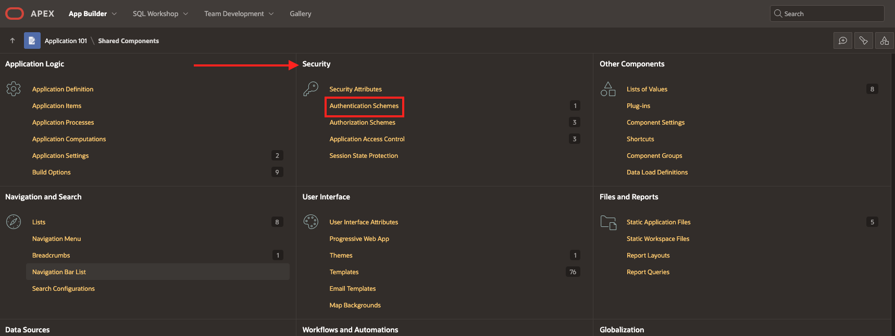

4.	Click **Create** in the top-right corner.

	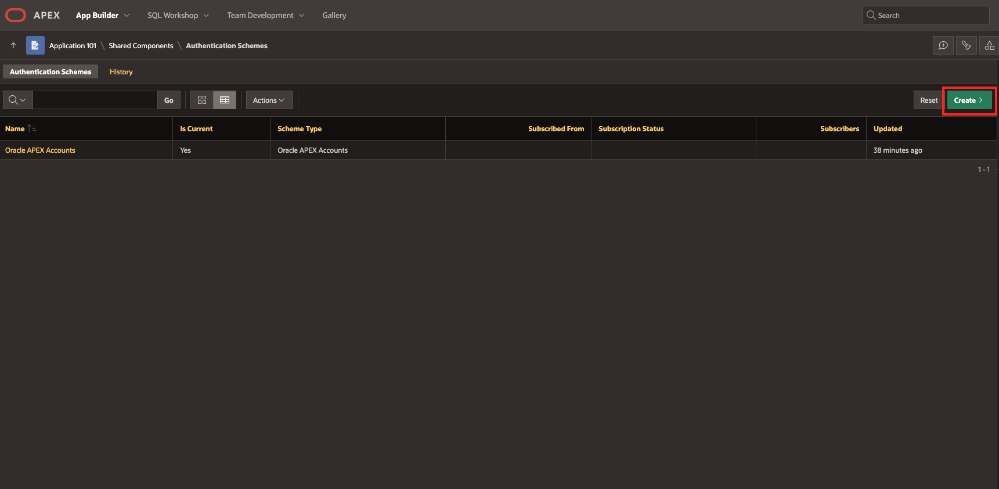

5.	Select **Create Scheme: Based on a pre-configured scheme from the gallery** and then click **Next**.

	

6.	Give the Authentication Scheme a **Name** – for example: “Custom authentication for end-user account creation” and select Custom as the **Scheme Type**.

	

7.	Where it says **Authentication Function Name** in the **Settings** section, put the name of your authentication function (in our case enter “authenticate_user”). Then click **Create Authentication Scheme**.

	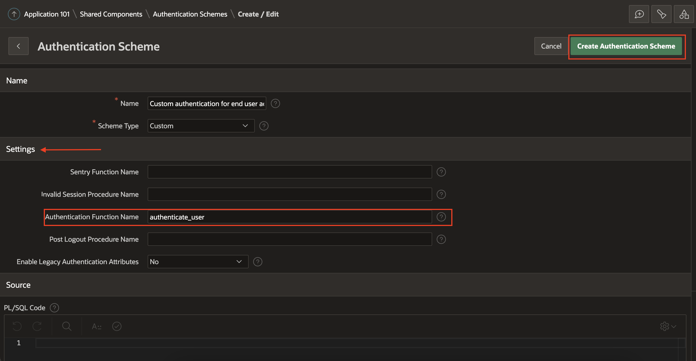

8.	It will take you back to the Authentication Schemes page. A green success message should appear at the top saying **Action processed**. Now click on the name of our new authentication scheme ("Custom authentication for end-user account creation").

	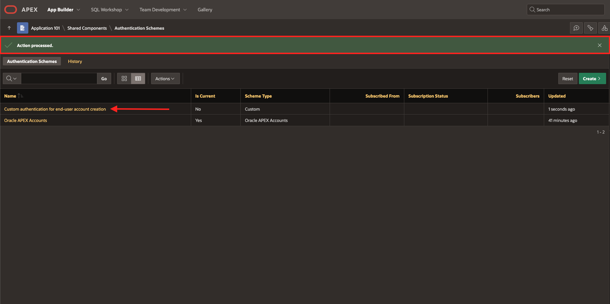

9. In the top-right corner, click the **Make Current Scheme** and then click **OK** in the subsequent pop-up window.

	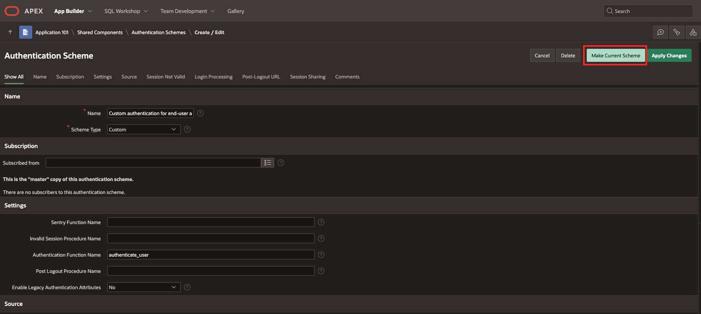
	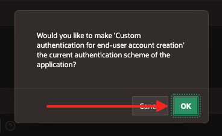

	> **Note:** It will take you back to the Authentication Schemes page. A green success message should appear at the top saying **Authentication scheme activated as current authentication scheme** and you will notice that in the **Is Current** column, there will be a "Yes" next to this authentication scheme now.

	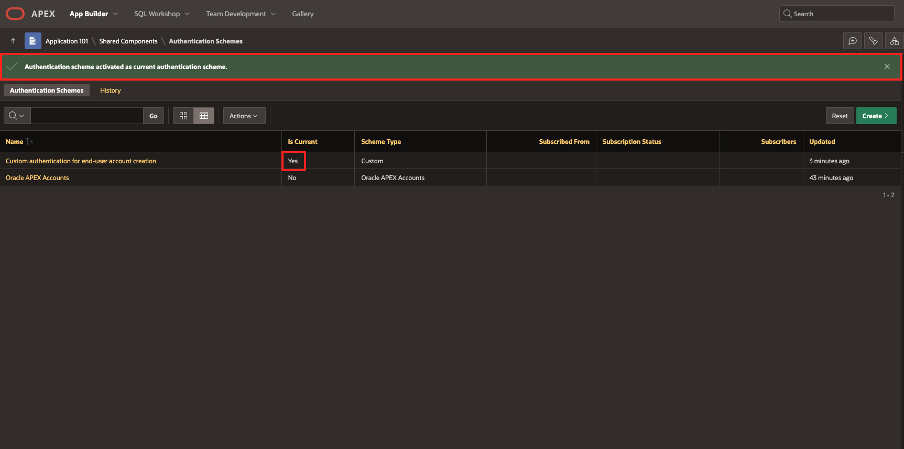

10. While we will not discuss Authorization Schemes in-depth in this workshop, we do need to make a change to our application's security as it pertains to Authorization in order for us to continue with the workshop. Return to the application home page by clicking on "Application XXX" from the Breadcrumb menu in the top-left.

	*Check out the [Learn More](#LearnMore) section at the end of this lab to learn more about Authorization Schemes.*

	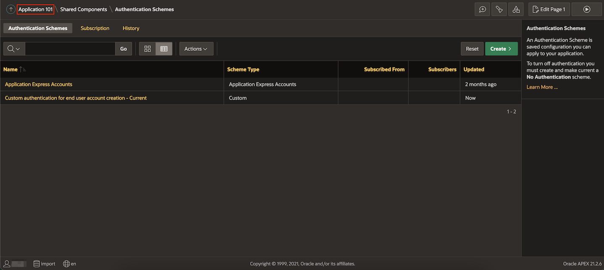

11. Click on the "Edit Application Definition" button in the top-right.

	

12. Navigate to the **Security** menu along the top toolbar.

	

13. Under **Authorization**, select "- No application authorization required -" for the **Authorization Scheme**. Then click **Apply Changes** in the top-right corner.

	

This concludes this lab. You may now **proceed to the next lab**.

## Learn More

* [Understanding Authentication](https://docs.oracle.com/en/database/oracle/apex/24.2/htmdb/understanding-authentication.html) in Oracle APEX
* [Creating an Authentication Scheme](https://docs.oracle.com/en/database/oracle/apex/24.2/htmdb/creating-an-authentication-scheme.html) in Oracle APEX
* [Custom Authentication](https://docs.oracle.com/en/database/oracle/apex/24.2/htmdb/custom-authentication.html) in Oracle APEX
* [Triggers](https://docs.oracle.com/en/database/oracle/apex/24.2/aeutl/managing-triggers.html) in Oracle APEX
* [DBMS_CRYPTO Interface](https://docs.oracle.com/en/database/oracle/oracle-database/23/arpls/DBMS_CRYPTO.html)
* [Understanding Authorization Schemes](https://docs.oracle.com/en/database/oracle/apex/24.2/htmdb/providing-security-through-authorization.html) in Oracle APEX

## Acknowledgements
* **Author** - Ana Beyer, Staff Cloud Engineer, Oracle
* **Last Updated By/Date** - Ana Beyer, June 2025
